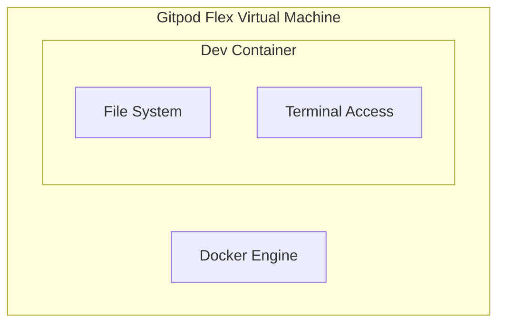

# Using Docker in Gitpod Flex Dev Environments

## Overview

Gitpod Flex dev environments support Docker in two primary ways:

1. **Using the pre-installed Docker engine** inside the host virtual machine (VM).
2. **Running Docker-in-Docker (DinD)** inside the dev container.

---

## Context

Every Gitpod Flex development environment runs inside a dedicated virtual machine. Inside this VM, Gitpod Flex launches a Docker engine, which in turn runs your dev container.

When you connect to your environment using an IDE, the terminal and file system you access are inside this dev container. This container is fully customizable and rebuildable to suit your development needs.

However, the outer VM and the host Docker engine are **not intended to be modified** by the user.

---

## Using Docker-in-Docker (DinD)

To run Docker inside your dev container independently of the host Docker engine, you can set up **Docker-in-Docker**.

This approach involves running a separate Docker daemon inside your dev container. Refer to [official DinD src for an example](https://github.com/devcontainers/features/tree/main/src/docker-in-docker) for configuration and security considerations.

---

## Docker Outside Docker (DoD)

An alternative to DinD is to use the **host's Docker engine** from within the dev container — a setup known as **Docker Outside Docker (DoD)**. This is done by mounting the Docker socket from the host into the container.

### Methods

#### 1. Use the `docker-outside-of-docker` DevContainer Feature

This is the recommended and most convenient method. See the [official repository for an example](https://github.com/devcontainers/features/tree/main/src/docker-outside-of-docker)

#### 2. Manual Setup

If you prefer not to use the DevContainer feature, you can configure DoD manually:

- [Docker socket mount instructions](https://github.com/meysholdt/docker-engine/blob/ccd5083e9a1826a1793d92af713a0456e6b6253f/.devcontainer/devcontainer.json#L8-L13)
- [Dockerfile installing Docker Engine and Compose](https://github.com/meysholdt/docker-engine/blob/ccd5083e9a1826a1793d92af713a0456e6b6253f/.devcontainer/Dockerfile#L8-L22)

---
